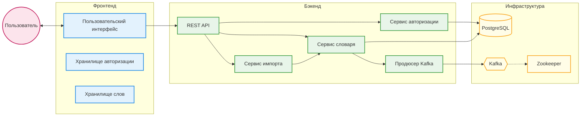
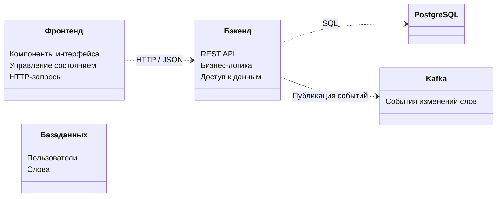

<div align="center">
    
    <h1>Документация проекта <a href="https://github.com/MindlessMuse666/jp-ru-dict/blob/main/README.md">j~dict!^w^</a></h1>
    <p><b><i>Личный японский словарь (∩^o^)⊃━☆</i></b></p>
    <br>

     <br>    
</div>

## 📖 [j~dict!\^w\^](https://github.com/MindlessMuse666/jp-ru-dict/blob/main/README.md) это...

...небольшое веб-приложение для ведения личного японского словаря. В нём вы можете создавать, читать, обновлять и удалять слова, а также организовывать слова по тегам и даже... управлять личным кабинетом и настраивать свою аватарку!😜

Этот пет-проект резюмирует практические навыки, полученные в процессе прохождения производстенной практики от [Колледжа связи №54 им. П. М. Вострухина](https://www.ks54.ru "Колледж связи №54 им. П. М. Вострухина") в организации [Инфотекс Интернет Траст](https://iitrust.ru "Инфотекс Интернет Траст").

## 🏗 Архитектура

### Диаграмма контейнеров

Основные части системы взаимодействуют следующим образом:

1. **Пользователь** работает с интерфейсом (**Фронтенда**);
2. **Фронтенд** отправляет запросы к **Бэкенду** (REST API);
3. **Бэкенд** сохраняет/читает данные из **PostgreSQL** и отправляет события изменений в **Kafka**.



### Диаграмма компонентов

Изнутри ИС настроена следующим образом:

* **Фронтенд:** Состоит из Vue-компонентов (UI), Pinia (хранение данных в памяти) и Axios (общение с сервером);
* **Бэкенд:** Разделен на слои:
  * *Handlers* (обработчики) - принимают HTTP-запросы;
  * *Services* (сервисы) - содержат бизнес-логику (правила работы);
  * *Repositories* (репозитории) - работают напрямую с базой данных.
* **База данных и Kafka:** Внешние системы для хранения данных и очереди событий.



## 🚀 Запуск проекта

Для запуска проекта необходимы установленные **Docker** и **docker-compose**.

### Быстрый старт через Makefile

Самый простой способ запустить проект - использовать `make`. Команды выполняются из корня проекта.

```bash
# Запуск всех сервисов (в фоновом режиме, с пересборкой)
make up

# Просмотр логов всех сервисов
make logs

# Остановка сервисов
make down
```

### Ручной запуск через [docker-compose.yml](./docker-compose "docker-compose")

Используйте команды `docker-compose` из корня проекта напрямую:

```bash
docker-compose up --build -d
```

Приложение будет доступно по адресу: [http://localhost:5173](http://localhost:5173 "Развёрнутое через docker-compose веб-приложение j~dict!^w^").

## 📚 API-Документация

API задокументировано с помощью [Swagger](./openapi.yaml "Swagger API-Документация"). После запуска бэкенда Swagger-документация доступна по адресу:

[http://localhost:8080/swagger/index.html](http://localhost:8080/swagger/index.html "Swagger API-Документация")

### Основные эндпоинты

* [Auth](./backend/internal/handler/auth.go "AuthHandler"):
  * `POST /api/auth/register` - Регистрация
  * `POST /api/auth/login` - Вход
  * `GET /api/auth/me` - Получение текущего пользователя
* [Words](./backend/internal/handler/word.go "WordHandler"):
  * `GET /api/words` - Получение списка слов
  * `POST /api/words` - Добавление слова
  * `PATCH /api/words/{id}` - Обновление слова
  * `DELETE /api/words/{id}` - Удаление слова
* [Import](./backend/internal/handler/import.go "ImportHandler"):
  * `POST /api/words/import` - Загрузка слов из CSV через Kafka

## 🛠 Технологический стек

| Область | Технология |
| ---- | --- |
| **Бэкенд** | Go (Golang), Gin Gonic, JWT-Auth |
| **Фронтенд** | Vue 3, Pinia, Vue Router, TailwindCSS, Vite |
| **База данных** | PostgreSQL 18 |
| **Брокер сообщений** | Apache Kafka (для асинхронной обработки импорта) |
| **Инфраструктура** | Docker, docker-compose, Makefile |
| **Документация** | Swagger (OpenAPI) |

## 📂 Структура проекта

```text
├── backend/            # Код бэкенда
│   ├── cmd/            # Точка входа (main.go)
│   ├── internal/       # Бизнес-логика, хендлеры, сервисы
│   ├── db/migrations/  # SQL-миграции
│   └── docs/           # Swagger-документация
├── frontend/           # Код фронтенда
│   ├── src/            # Компоненты, сторы, представления
├── docker-compose.yml  # Описание сервисов и их связей
└── Makefile            # Команды для управления проектом
```

## 🌐 GitHub Pages (Демо)

В этой ветке находится статическая версия фронтенда, которая используется для демо интрефейса проекта на GitHub Pages.

**ВАЖНО!** Без запущенного локально бэкенда функционал API (авторизация, загрузка слов) работать **не будет**.

---

<div align="center">
    <a href="#jdictw">
        
    </a>
    <br>
    <sub><b>Веб-приложение // j~dict!^w^</b></sub>
    <br>
    <sup><i>Made with love by <a href="https://github.com/MindlessMuse666" target="_blank" title="MindlessMuse666">MindlessMuse666</a></i></sup>
</div>
