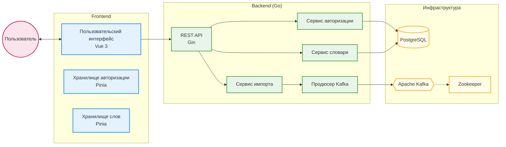
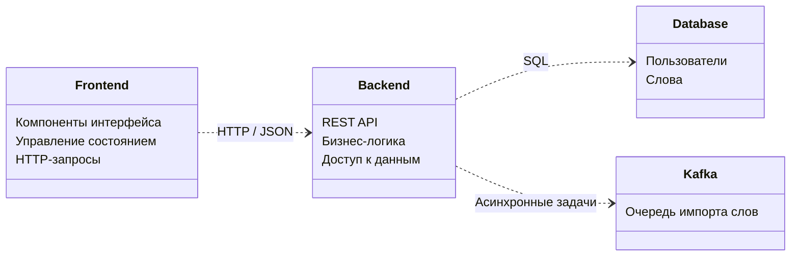
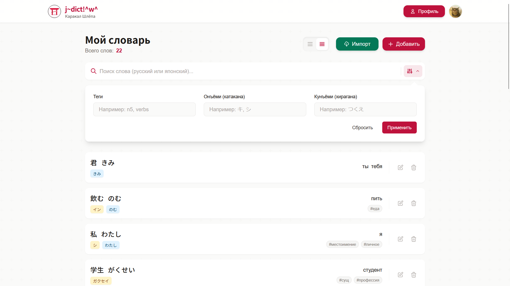
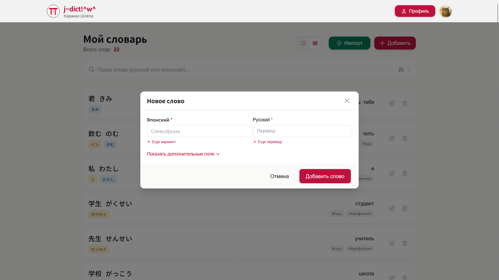
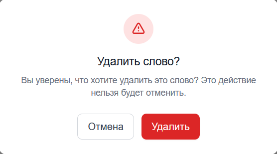

    
    <h1>Отчет о разработке информационной системы</h1>
    <h2>"Японский Словарь" (j~dict!^w^)</h2>
    
<b><i>Курсовой проект /ᐠ｡ꞈ｡ᐟ\</i></b>

## Введение

В рамках производственной практики была спроектирована и реализована информационная система (ИС) для ведения личного японского словаря. Система предназначена для изучающих японский язык и позволяет создавать, редактировать, удалять и искать слова с поддержкой различных чтений (онъёми, кунъёми) и примеров использования.

Целью проекта являлось создание веб-приложения с использованием микросервисных паттернов (в упрощенном виде) и контейнеризации.

## 1. Архитектура и технологии

### 1.1. Технологический стек

Для реализации ИС был выбран следующий стек технологий:

* **Бэкенд:** Go 1.25.5 - для реализации REST API;
* **Фронтенд:** Vue.js 3 + Vite + TailwindCSS - для создания UI;
* **База данных:** PostgreSQL 18 - основное реляционное хранилище данных;
* **Брокер сообщений:** Apache Kafka - для асинхронной обработки тяжелых задач (импорт словарей);
* **Деплой:** Docker и docker-compose - для оркестрации сервисов;
* **Документация:** Swagger (OpenAPI 3.0) - для документирования API.

### 1.2. Архитектура приложения

ИС построена по клиент-серверной архитектуре. Клиентская часть (SPA) взаимодействует с сервером через REST API.

#### Диаграмма контейнеров

Взаимодействие основных частей системы:

1. **Пользователь** работает с интерфейсом (**Frontend**).
2. **Frontend** отправляет запросы к **Backend** (REST API).
3. **Backend** сохраняет/читает данные из **PostgreSQL** и отправляет задачи на импорт в **Kafka**.

#### Диаграмма компонентов

Детальное устройство системы изнутри:

* **Frontend:** Состоит из Vue-компонентов (отображение), Pinia (хранение данных в памяти) и Axios (общение с сервером).
* **Backend:** Разделен на слои:
  * *Handlers* (обработчики) - принимают HTTP-запросы.
  * *Services* (сервисы) - содержат бизнес-логику (правила работы).
  * *Repositories* (репозитории) - работают напрямую с базой данных.
* **Database & Kafka:** Внешние системы для хранения данных и очереди задач.

## 2. Реализация функционала

### 2.1. База данных

Используется PostgreSQL. Реализована схема данных с пользователями и словами. Для слов используются массивы (`text[]`) для хранения вариантов перевода, чтений и тегов, что позволяет гибко искать по любому вхождению.

    
    
<i>Рис. 1. Схема базы данных в PostgreSQL</i>

### 2.2. Бэкенд (API)

Реализован RESTful API на Go с использованием фреймворка Gin.

Основные возможности API:

* **Auth**: Регистрация и аутентификация через JWT.
* **Words**: CRUD-операции со словами, курсорная пагинация, сложный поиск.
* **System**: Health-checks, метрики.

Документация API доступна через Swagger UI:
> Ссылка: [http://localhost:8080/swagger/index.html](http://localhost:8080/swagger/index.html)

    
    
<i>Рис. 2. Интерактивная документация Swagger UI</i>

### 2.3. Фронтенд

Интерфейс разработан на Vue 3 (Composition API). Реализована адаптивная верстка, модальные окна для редактирования, "умный" поиск с дебаунсом.

> Локальная версия: [http://localhost:5173](http://localhost:5173)
> Демонстрация (GitHub Pages): [https://mindlessmuse666.github.io/jp-ru-dict/](https://mindlessmuse666.github.io/jp-ru-dict/)

    
    
<i>Рис. 3. Главная страница приложения</i>

     
    
    
<i>Рис. 4. Модальное окно: Добавление нового слова</i>

     
    
    
<i>Рис. 5. Модальное окно: Редактирование слова</i>

     
    
    
<i>Рис. 6. Модальное окно: Удаление слова</i>

## 3. Инструменты разработки и администрирования

Для управления проектом используется `Makefile`, автоматизирующий рутинные задачи (запуск, миграции, логи).

Для администрирования БД подключен **pgAdmin 4**:
> Ссылка: [http://localhost:5050](http://localhost:5050)

## Заключение

В ходе работы была успешно разработана и протестирована ИС личного словаря. Проект демонстрирует использование подходов к проектировеб-разработке и готов к дальнейшему расширению.

---

    
     
    <b>Веб-приложение // j~dict!^w^</b>
     
    <i>Made with love by <a href="https://github.com/MindlessMuse666" target="_blank" title="MindlessMuse666">MindlessMuse666</a></i>

