

    
    <h1>Отчет о разработке информационной системы</h1>
    <h2>"Японский Словарь" (j~dict!^w^)</h2>
    
<b><i>Проект производственной практики /ᐠ｡ꞈ｡ᐟ\</i></b>

## Введение

В рамках производственной практики была спроектирована и реализована информационная система (ИС) для ведения личного японского словаря. Система предназначена для изучающих японский язык и позволяет создавать, редактировать, удалять и искать слова с поддержкой различных чтений (онъёми, кунъёми) и примеров использования.

Целью проекта являлось создание веб-приложения с использованием микросервисных паттернов (в упрощенном виде) и контейнеризации.

## 1. Архитектура и технологии

### 1.1. Стек

Для реализации ИС был выбран следующий стек технологий:

* **Бэкенд:** Go 1.25.5 - для реализации REST API;
* **Фронтенд:** Vue.js 3 + Vite + TailwindCSS - для создания UI;
* **База данных:** PostgreSQL 18 - основное реляционное хранилище данных;
* **Брокер сообщений:** Apache Kafka - для публикации событий изменений данных (CDC-паттерн);
* **Деплой:** Docker и docker-compose - для оркестрации сервисов;
* **Документация:** Swagger (OpenAPI 3.0) - для документирования API.

### 1.2. Архитектура приложения

ИС построена по клиент-серверной архитектуре. Клиентская часть (SPA) взаимодействует с сервером через REST API.

#### Диаграмма контейнеров

Основные части системы взаимодействуют следующим образом:

1. **Пользователь** работает с интерфейсом (**Фронтенда**);
2. **Фронтенд** отправляет запросы к **Бэкенду** (REST API);
3. **Бэкенд** сохраняет/читает данные из **PostgreSQL** и отправляет события изменений в **Kafka**.

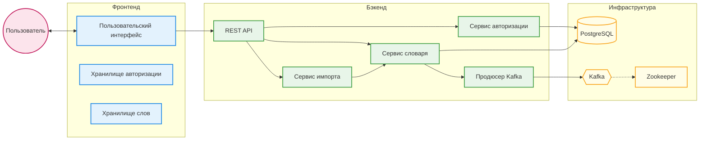

#### Диаграмма компонентов

Изнутри ИС настроена следующим образом:

* **Фронтенд:** Состоит из Vue-компонентов (UI), Pinia (хранение данных в памяти) и Axios (общение с сервером);
* **Бэкенд:** Разделен на слои:
  * *Handlers* (обработчики) - принимают HTTP-запросы;
  * *Services* (сервисы) - содержат бизнес-логику (правила работы);
  * *Repositories* (репозитории) - работают напрямую с базой данных.
* **База данных и Kafka:** Внешние системы для хранения данных и очереди событий.

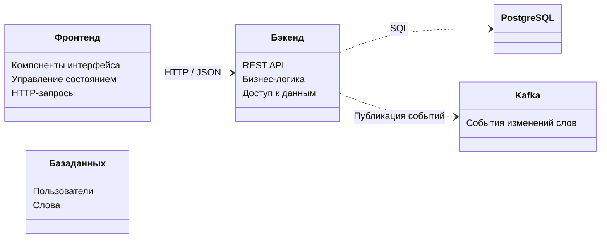

## 2. Реализация функционала

### 2.1. Бэкенд (API)

Реализован RESTful API на Go с использованием фреймворка Gin.

Основные возможности API:

* **Auth**: Регистрация и аутентификация через JWT.
* **Words**: CRUD-операции со словами, курсорная пагинация, сложный поиск.
* **System**: Health-checks, метрики.

Документация API доступна через Swagger UI:
> Ссылка: [http://localhost:8080/swagger/index.html](http://localhost:8080/swagger/index.html)

    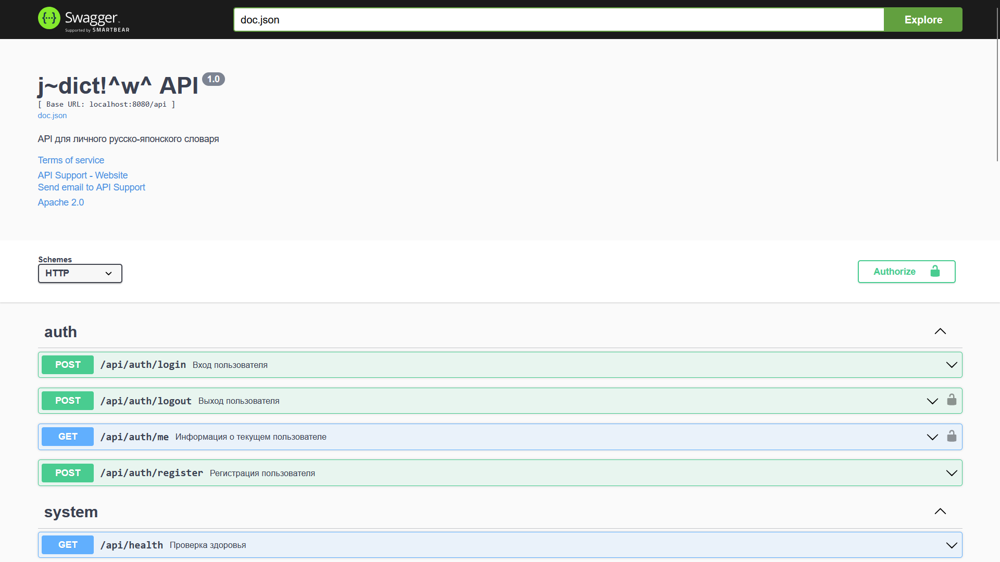
    
<i>Рис. 1. Документация Swagger UI</i>

### 2.2. База данных

Используется PostgreSQL. Реализована схема данных с пользователями и словами. Для слов используются массивы (`text[]`) для хранения вариантов перевода, чтений и тегов, что позволяет гибко искать по любому вхождению.

    
    
<i>Рис. 2. Схема базы данных в PostgreSQL</i>

### 2.3. Фронтенд

UI разработан на Vue 3 (Composition API). Реализована адаптивная верстка, модальные окна для редактирования, компактный и подробный режимы и поиск по фильтрам.

> Локальная версия: [http://localhost:5173](http://localhost:5173)
> Демонстрация (GitHub Pages): [https://mindlessmuse666.github.io/jp-ru-dict/](https://mindlessmuse666.github.io/jp-ru-dict/)

#### Превью основного интерфейса

    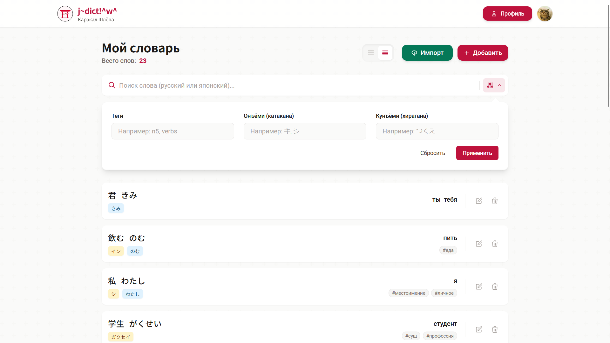
    
<i>Рис. 3. Главная страница приложения (базовый вид)</i>

     
    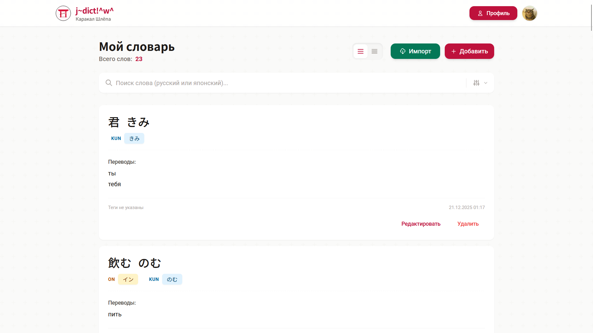
    
<i>Рис. 4. Главная страница приложения (расширенный вид)</i>

     
    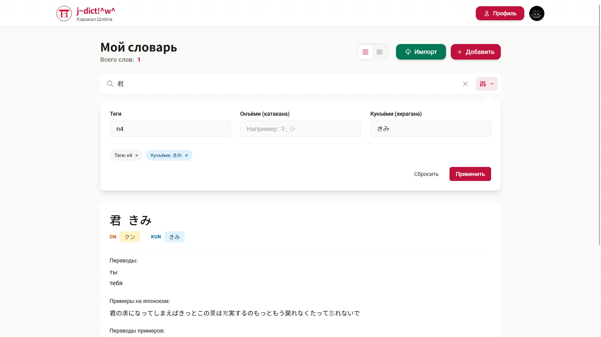
    
<i>Рис. 5. Главная страница приложения (поиск)</i>

     
    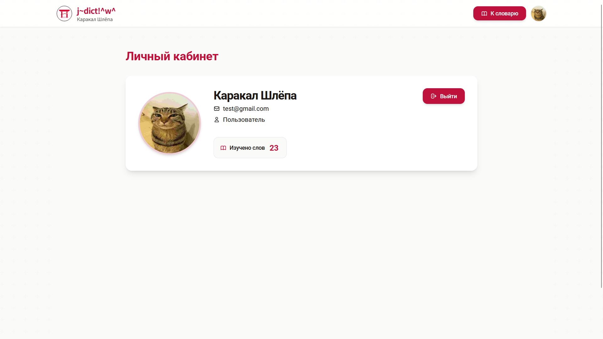
    
<i>Рис. 6. Профиль пользователя</i>

#### Превью функционала

    
    
<i>Рис. 7. Модальное окно: Добавление нового слова</i>

     
    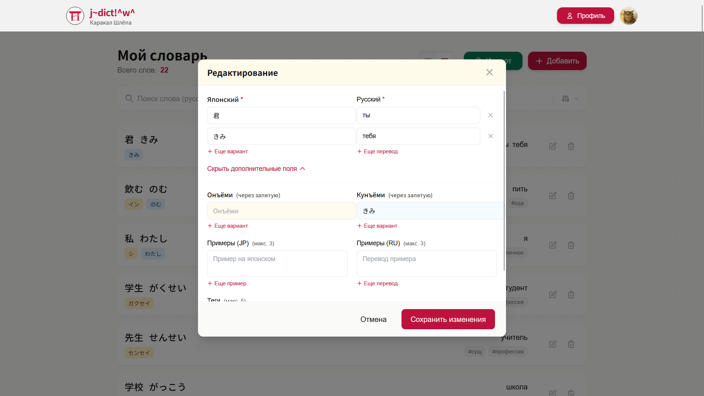
    
<i>Рис. 8. Модальное окно: Редактирование слова</i>

     
    
    
<i>Рис. 9. Модальное окно: Удаление слова</i>

     
    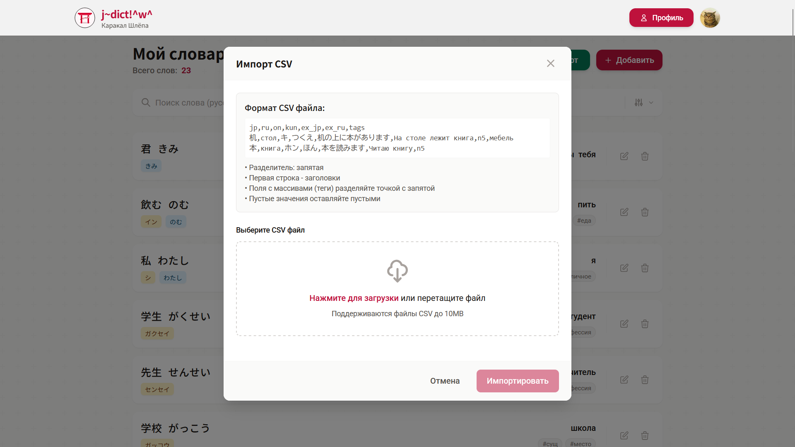
    
<i>Рис. 10. Модальное окно: Импорт слов</i>

### 2.4. Брокер сообщений

Используется Kafka для публикации событий изменений данных (создание, обновление, удаление слов). Это позволяет в будущем подключать новые сервисы (например, аналитику или уведомления) без изменения основного бэкенда.

    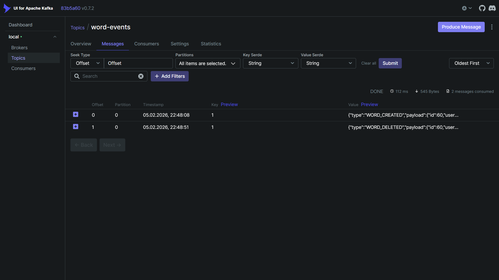
    
<i>Рис. 11. Интерфейс Kafka UI</i>

## 3. Инструменты разработки и администрирования

Для управления проектом используется [Makefile](../Makefile "Makefile"), который автоматизирует запуск и просмотр логов.

Для администрирования БД подключен **pgAdmin 4**:
> Ссылка: [http://localhost:5050](http://localhost:5050)

## 4. Небольшая фишка

Пользователь на странице профиля может управлять своей аватаркой!
Есть два интересных сценария и сценарий удаления аватара (сброса до дефолтного).

### Сценарий 1: Загрузка пользовательской аватарки

    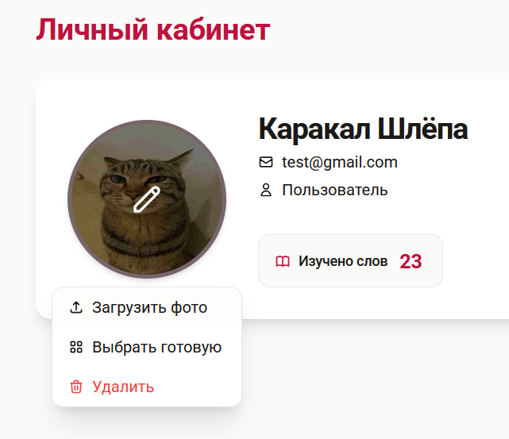
    
<i>Рис. 12. Шаг 1: Страница профиля</i>

     
    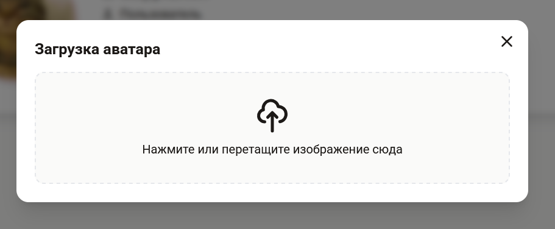
    
<i>Рис. 13. Шаг 2: Окно загрузки аватара</i>

     
    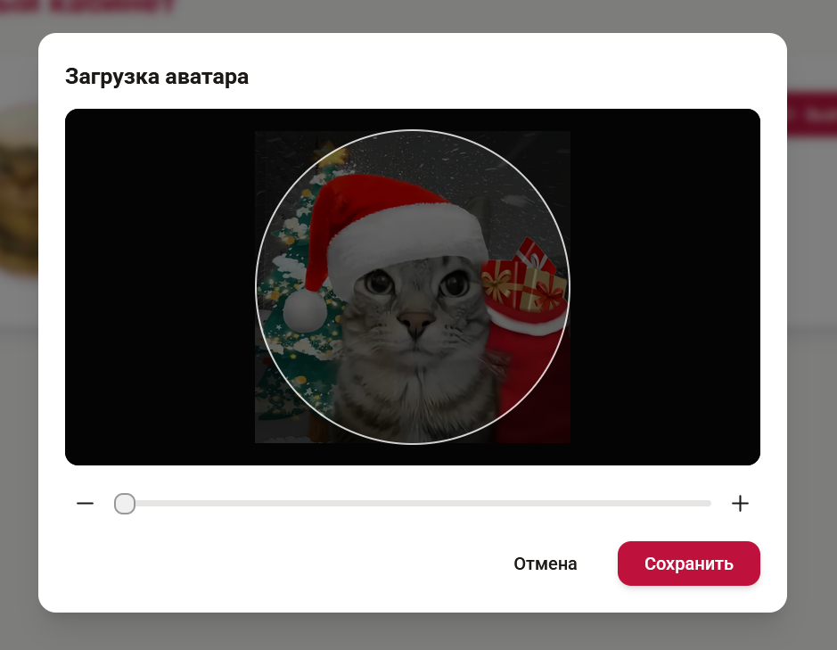
    
<i>Рис. 14. Шаг 3: Обрезка аватара</i>

     
    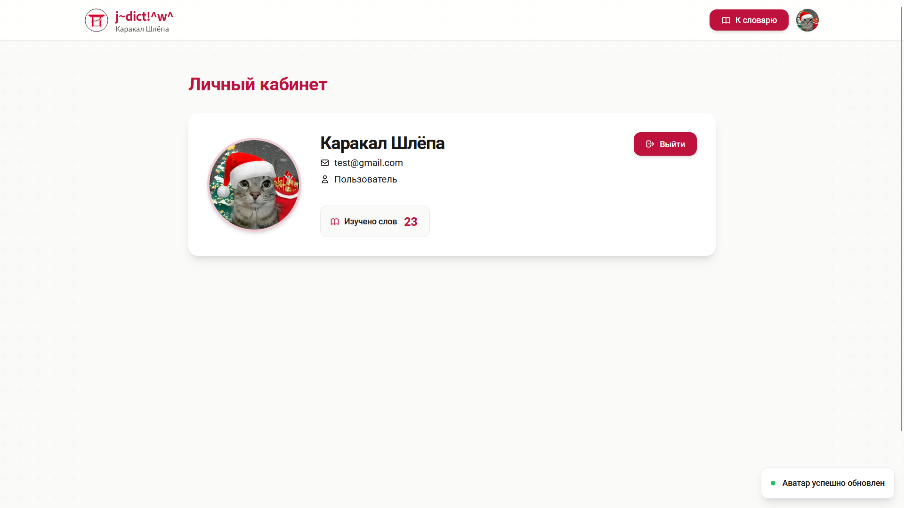
    
<i>Рис. 15. Шаг 4: Аватар успешно загружен + Тост</i>

### Сценарий 2: Установка аватарки из предлагаемых

    
    
<i>Рис. 16. Шаг 1: Страница профиля</i>

     
    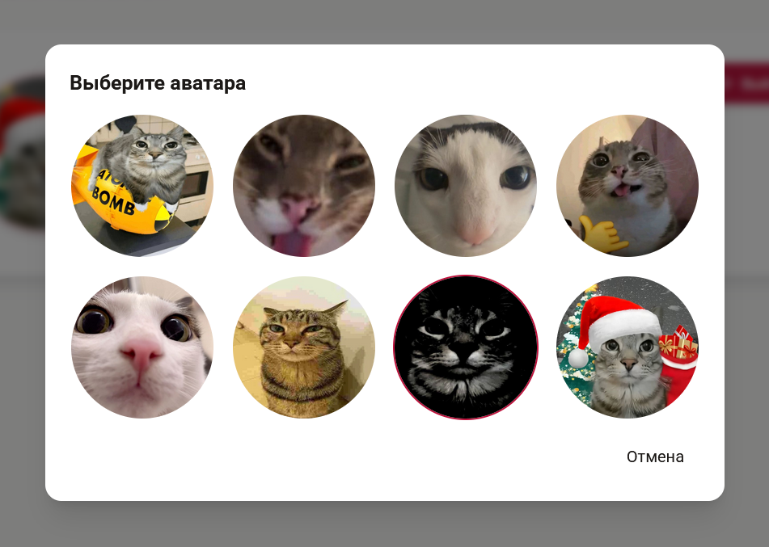
    
<i>Рис. 17. Шаг 2: Окно установки предустановленного аватара</i>

     
    
    
<i>Рис. 18. Шаг 4: Аватар успешно установлен + Тост</i>

## Заключение

В ходе работы была успешно разработана и протестирована ИС личного словаря. Проект демонстрирует использование подходов к веб-разработке и готов к дальнейшему расширению.

---

    
     
    <b>Веб-приложение // j~dict!^w^</b>
     
    <i>Made with love by <a href="https://github.com/MindlessMuse666" target="_blank" title="MindlessMuse666">MindlessMuse666</a></i>

